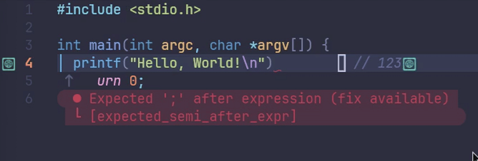

# 🔚 micro-append.nvim

> **"Don't let a missing semicolon break your flow."**

`micro-append` is a lightweight Neovim plugin designed to handle **End-of-Line (EOL) character appending** intelligently.

Unlike standard Vim macros or simple mappings, `micro-append` is **context-aware**. It detects inline comments, cleans up trailing whitespace, and inserts the terminator (e.g., `;` or `,`) exactly where it belongs—*before* the comment, not after it.



## ✨ Features

* **🧠 Smart Comment Detection**: Automatically detects comment leaders (like `//`, `#`, `--`) and inserts the character **before** the comment.
* **🧹 Auto-Formatting**: Cleans up trailing spaces and ensures proper spacing between code and comments.
* **📂 Filetype Sensitive**:
* Automatically appends `;` for C, C++, Rust, Java, JS, etc.
* Do nothing (safeguard) for Python, Lua, Go.
* Fully customizable per filetype.


* **⚡ Zero Dependencies**: Written in pure Lua. Blazing fast (< 0.1ms).
* **🛡️ Idempotent**: It won't add a duplicate character if one already exists.

## 📸 Demo

**Scenario 1: Standard Code**

```c
// Before (Cursor anywhere on the line)
int count = 0|

// After (<A-;>)
int count = 0;|

```

**Scenario 2: Inline Comments (The Killer Feature)**

```rust
// Before
let name = "Neo"|    // User name

// After (<A-;>)
let name = "Neo";|   // User name

```

*(Note: It correctly inserts the semicolon before the comment and fixes spacing)*

**Scenario 3: Python (Safety Check)**

```python
// Before
print("Hello World")|

// After (<A-;>)
print("Hello World")|
// (Nothing happens, because Python doesn't use semicolons)

```

## 📦 Installation

### Using [lazy.nvim](https://github.com/folke/lazy.nvim)

If you are developing this locally (recommended):

```lua
return {
  "micro-append",
  -- Point this to your local file path
  dir = vim.fn.stdpath("config") .. "/lua/micro_logic.lua", 
  
  config = function()
    local micro = require("micro_logic") -- Ensure this matches your filename
    micro.setup({})
    
    -- Recommended Keymap: Alt + ;
    vim.keymap.set({"n", "i"}, "<A-;>", micro.append, { desc = "Smart Append EOL" })
  end
}

```

## ⚙️ Configuration

The plugin comes with sensible defaults, but you can override them in the `setup()` function.

```lua
require("micro_logic").setup({
    -- Default character to append if filetype is not found in the map
    default_char = ";", 
    
    -- Filetype specific configurations
    ft_map = {
        c = ";",
        cpp = ";",
        rust = ";",
        java = ";",
        javascript = ";",
        typescript = ";",
        
        -- Languages that don't need terminators
        go = "",     
        python = "", 
        lua = "",    
        
        -- Pro Tip: JSON often needs commas!
        json = ",",  
    }
})

```

## ⌨️ Keymaps

By default, `micro-append` **does not** pollute your keybindings. You need to set them up yourself.

We highly recommend using `Alt` (Meta) keys so you can trigger it without leaving Insert Mode.

```lua
-- Append the default character (e.g., semicolon)
vim.keymap.set({"n", "i"}, "<A-;>", function() require("micro_logic").append() end, { desc = "Smart Append ;" })

-- Force append a comma (Useful for Structs/Lists/JSON)
-- Note: Requires modifying the append function to accept arguments, or creating a wrapper.
-- vim.keymap.set({"n", "i"}, "<A-,>", function() ... end)

```

## 🤝 Contributing

This plugin follows the **Unix Philosophy**: Do one thing and do it well. PRs that improve comment detection accuracy or add useful default filetypes are welcome.

## 📄 License

GPL-v3
